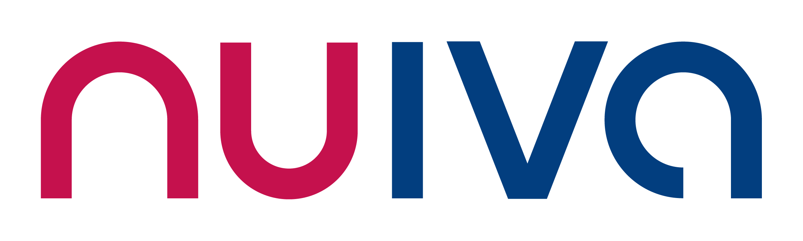
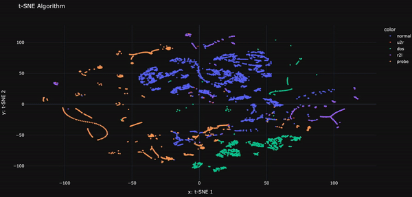

## Projects

### Nuiva

#### [AI-Agent — Generating unit test for springboot server (Nuiva)]()

Developed an AI-powered agent to automatically generate, execute, and refine unit tests in Java for Spring Boot servers, specifically for TMForum's OpenAPIs.   
[*Read more →*]()

---
#### [AI predictive maintenance (Nuiva)]()
This project integrates two key components to enhance fault management systems:
- Relevant Alarm Detection: A classification model that identifies alarms as either relevant (requiring investigation) or irrelevant (e.g., transient alarms).  
- Predictive Maintenance: A forecasting system that predicts future alarm occurrences over the next 14 days, along with their respective alarm types.   

[*Read more →*]()

---
### Network Intrusion Detection

<!--  -->

This project develops a machine learning-based classifier to effectively distinguish between intrusive (malicious) and non-intrusive (benign) network traffic. Advanced preprocessing and SMOTE are applied to improve detection capabilities, resulting in a highly effective system for identifying attacks.

[*Read more →*](./projects/Network_intrusion/network_intrusion.md)

> *Project presentation →* [Animated presentation](https://www.canva.com/design/DAGBT2SaVYM/TflYMLkLgUNVdMI1IJC9Hg/view?utm_content=DAGBT2SaVYM&utm_campaign=designshare&utm_medium=link&utm_source=editor)

| Interactive plots | Links |
|-------------------|-------|
| 2D plot           | [visualization](projects/Network_intrusion/figures/html/tsne_dark_5000.html) |
| 3D plot           | [visualization](projects/Network_intrusion/figures/html/tsne_white3D_5000.html) |

---

### Automatic Detection of Legal Query Series - State Council of France

As part of my Master's in Data Science at Université Paris-Saclay, this project was conducted during my apprenticeship at the Conseil d'État. It focused on automating the classification of legal query series, significantly enhancing the efficiency, accuracy, and reliability of the institution's data management processes.

[*Read more →*](./projects/Conseil_d_etat/CE.md)

 *(French version)*

---

### Deep Contrastive Learning

This project uses SimCLR, a contrastive learning method, to train a model on the MNIST dataset with minimal labeled data. By leveraging unsupervised techniques, it enhances feature representation and achieves a 7% improvement in accuracy over traditional models.

[*Read more →*](./projects/SimCLR/SimCLR.md)

---

### Turnover Prediction

This project focuses on predicting employee turnover within a company using survival analysis and classification methods in R. By comparing models like Cox proportional hazards and Survival Random Forests against traditional classification approaches, the goal is to predict an employee’s risk of leaving within a year, enhancing strategic human resource planning.

[*Read more →*](https://ahmedosman00py.github.io/Turnover/)

