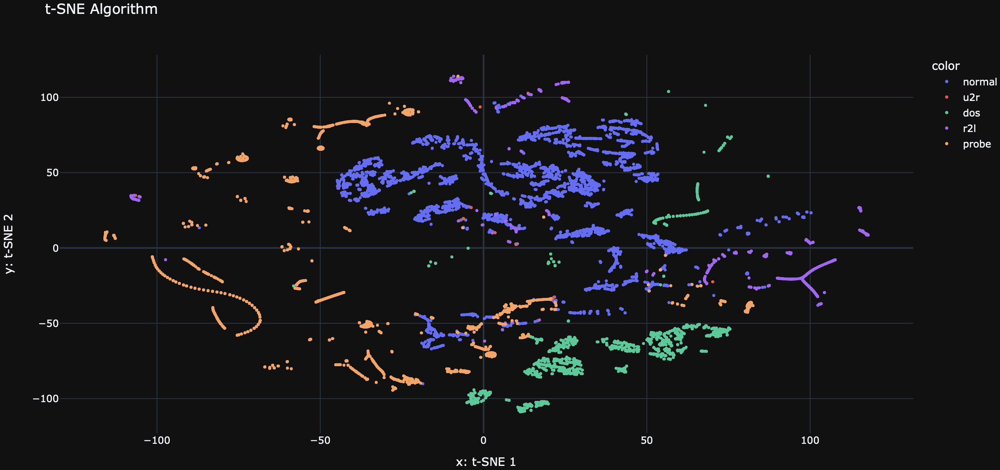
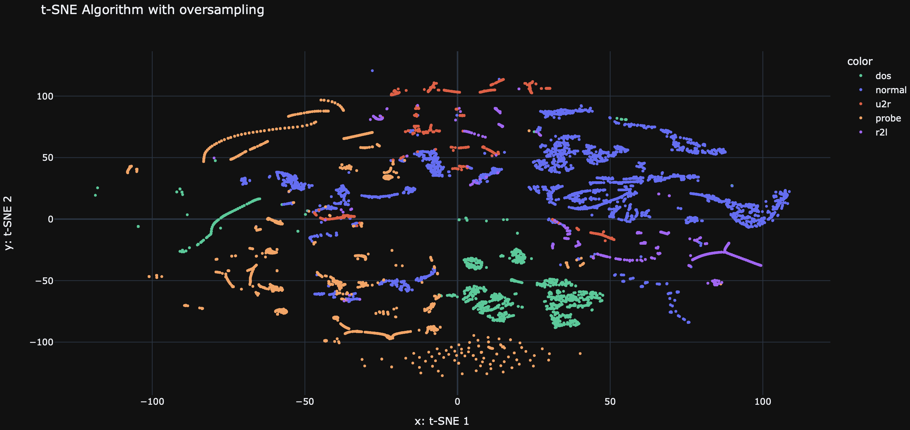
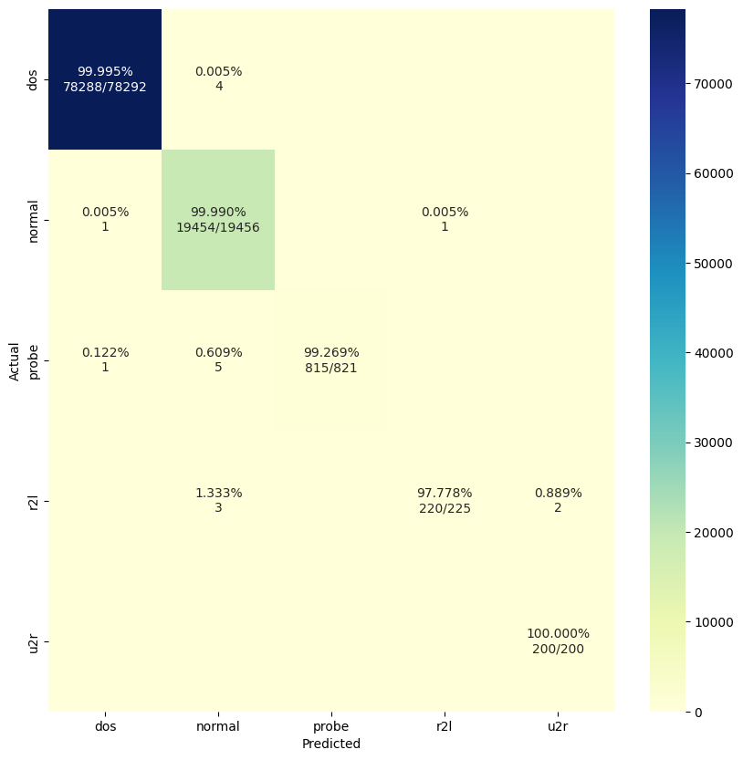

# Système de Détection d'Intrusions Réseau

Ce projet d'apprentissage automatique vise à développer un **classificateur** capable de **différencier précisément** le trafic réseau **intrusif (malveillant)** du trafic **non intrusif (bénin)**.

## Vue d’ensemble du projet

L'objectif de ce projet est d'analyser et d'évaluer différentes méthodes de détection d'intrusions. À l'aide d'un ensemble de données complet, un modèle prédictif a été développé pour **classer les connexions réseau** comme étant soit **normales**, soit **des attaques spécifiques** appartenant à différentes catégories.

> [Voici la présentation animée du projet.](https://www.canva.com/design/DAGBT2SaVYM/TflYMLkLgUNVdMI1IJC9Hg/view?utm_content=DAGBT2SaVYM&utm_campaign=designshare&utm_medium=link&utm_source=editor) 

---

## Description des données

L'ensemble de données utilisé dans ce projet provient d'un **environnement réseau** simulant un **réseau local standard de l'US Air Force**, dans lequel divers types d'attaques ont été injectés. Les données, fournies par **Lincoln Labs**, couvrent **neuf semaines** de captures brutes de paquets TCP converties en **enregistrements de connexions réseau** soigneusement étiquetés.

L'ensemble de données est accessible [ici](http://kdd.ics.uci.edu/databases/kddcup99/kddcup99.html).

Chaque connexion est définie par une **série de paquets TCP**, se produisant à des moments précis et transférant des données entre **adresses IP source et destination** sous des protocoles spécifiques. Ces connexions sont **étiquetées** comme **normales** ou classées dans l'une des catégories suivantes d’attaques :

- **DOS (*Denial-of-Service*)** : Attaques visant la disponibilité des ressources, incluant des attaques comme les **SYN floods**.
- **R2L (*Remote to Local*)** : Tentatives d'accès non autorisé à partir d'une machine distante, par exemple via des attaques **par devinette de mots de passe**.
- **U2R (*User to Root*)** : Attaques où un utilisateur local tente d'obtenir **des privilèges superutilisateur (root)**, souvent via **des dépassements de mémoire tampon (buffer overflow)**.
- **Probing** : Activités de **reconnaissance du réseau** pour collecter des informations ou exploiter des vulnérabilités connues (*ex: scan de ports*).

---

## **Méthodologie**

### **Gestion et Prétraitement des Données**

- **Contrôle de Version des Données (DVC) avec GCP Bucket** : Intégration de DVC avec **Google Cloud Platform (GCP)** pour la gestion des données.
- **Suppression des Variables Hautement Corrélées** : Analyse des **corrélations entre variables** afin de **réduire le surajustement**.
- **Encodage et Mise à l’Échelle** : **Encodage des variables catégorielles** et **mise à l'échelle** des variables numériques pour standardiser l’ensemble de données.
- **Réduction de Dimensionnalité** : Utilisation de **PCA (Analyse en Composantes Principales)**, **t-SNE (t-Distributed Stochastic Neighbor Embedding)** et **UMAP (Uniform Manifold Approximation and Projection)** pour améliorer la visualisation des structures des données et identifier les **modèles sous-jacents**.

### **Développement et Évaluation du Modèle**

- **Modèle de Base** : Implémentation d'un **Random Forest** comme **baseline** pour évaluer la performance de classification.
- **Suréchantillonnage avec SMOTE** : Utilisation de **SMOTE (*Synthetic Minority Over-sampling Technique*)** pour équilibrer la distribution des classes et améliorer la détection des attaques sous-représentées.
- **Métriques de Performance** : L’**indice F1** a été utilisé comme **métrique principale** pour évaluer la performance du modèle, en équilibrant :
  - **Précision** (*exactitude des étiquettes attribuées aux attaques*).
  - **Rappel** (*capacité à détecter l’ensemble des attaques réelles*).

---

## **Visualisation**

Pour comprendre **la répartition et les regroupements des connexions réseau**, nous avons utilisé **t-SNE** pour réduire la dimensionnalité et visualiser les données en **2D**.

Les **graphiques t-SNE** permettent d’observer :
- La séparation entre **les connexions normales et les différentes attaques**.
- Des **groupements distincts** qui révèlent des **anomalies potentielles** dans le trafic réseau.

---

## **Performance du Modèle**

### **Avant SMOTE**
Voici les **métriques de classification** du **modèle de base (Random Forest)** :

| Classe  | Précision | Rappel | Score F1 | Support |
|---------|-----------|--------|----------|---------|
| dos     | 1.00      | 1.00   | 1.00     | 78292   |
| normal  | 1.00      | 1.00   | 1.00     | 19456   |
| probe   | 1.00      | 1.00   | 1.00     | 822     |
| r2l     | 1.00      | 0.96   | 0.98     | 225     |
| **u2r** | **0.75** | **0.60** | **0.67** | **10** |
|         |           |        |          |         |
| **Exactitude** |       |    | 1.00     | 98805   |
| **Moyenne Macro** | 0.95 | 0.91   | 0.93     | 98805   |
| **Moyenne Pondérée** | 1.00 | 1.00   | 1.00     | 98805   |

> ***Score F1 moyen pondéré : 99.9752%***

---

### **Après SMOTE**
Après l’application de **SMOTE** pour rééquilibrer les classes, les nouvelles métriques sont :

| Classe  | Précision | Rappel | Score F1 | Support |
|---------|-----------|--------|----------|---------|
| dos     | 1.00      | 1.00   | 1.00     | 78292   |
| normal  | 1.00      | 1.00   | 1.00     | 19456   |
| probe   | 1.00      | 0.99   | 1.00     | 821     |
| r2l     | 1.00      | 0.98   | 0.99     | 225     |
| **u2r** | **0.99** | **1.00** | **1.00** | **200** |
|         |           |        |          |         |
| **Exactitude** |       |        | 1.00     | 98994   |
| **Moyenne Macro** | 1.00 | 0.99   | 1.00     | 98994   |
| **Moyenne Pondérée** | 1.00 | 1.00   | 1.00     | 98994   |

> ***Score F1 moyen pondéré : 99.9827%***

---

### **Matrice de Confusion (Modèle Final)**

