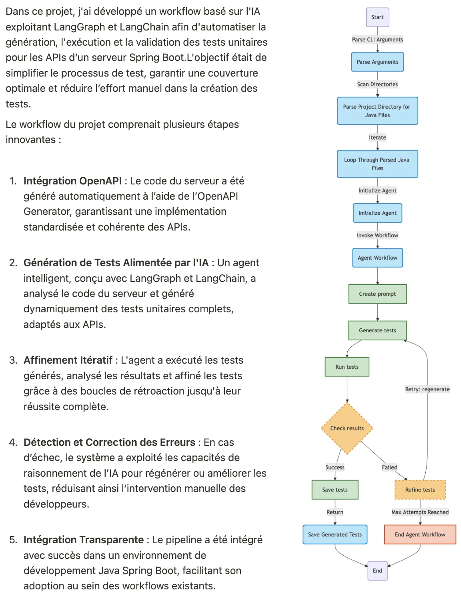

## Génération de Tests Unitaires Alimentée par l'IA pour les APIs Spring Boot

Ce projet a exploité **les meilleures pratiques d’ingénierie logicielle** en mettant en place un code modulaire et maintenable, garantissant ainsi l'évolutivité et la réutilisabilité à travers différents workflows.

En combinant **LLM d'OpenAI** avec **LangGraph** et **LangChain**, le système tire parti des technologies d'IA les plus avancées pour automatiser et simplifier la création de tests unitaires.  
Afin de garantir un environnement de développement cohérent, l’ensemble du pipeline a été conteneurisé avec **Docker**, permettant un déploiement fluide et éliminant les problèmes liés aux différences d’environnement.  
De plus, un **Makefile** a été conçu pour automatiser les tâches répétitives, simplifiant l'exécution des commandes et réduisant l'effort des développeurs.  

Cette automatisation a non seulement amélioré la productivité, mais a également rendu le système particulièrement convivial pour les développeurs.  
L’association entre une conception modulaire, une automatisation pilotée par l'IA et des outils robustes** a fait de ce pipeline une solution efficace, évolutive et indispensable au cycle de développement**.
