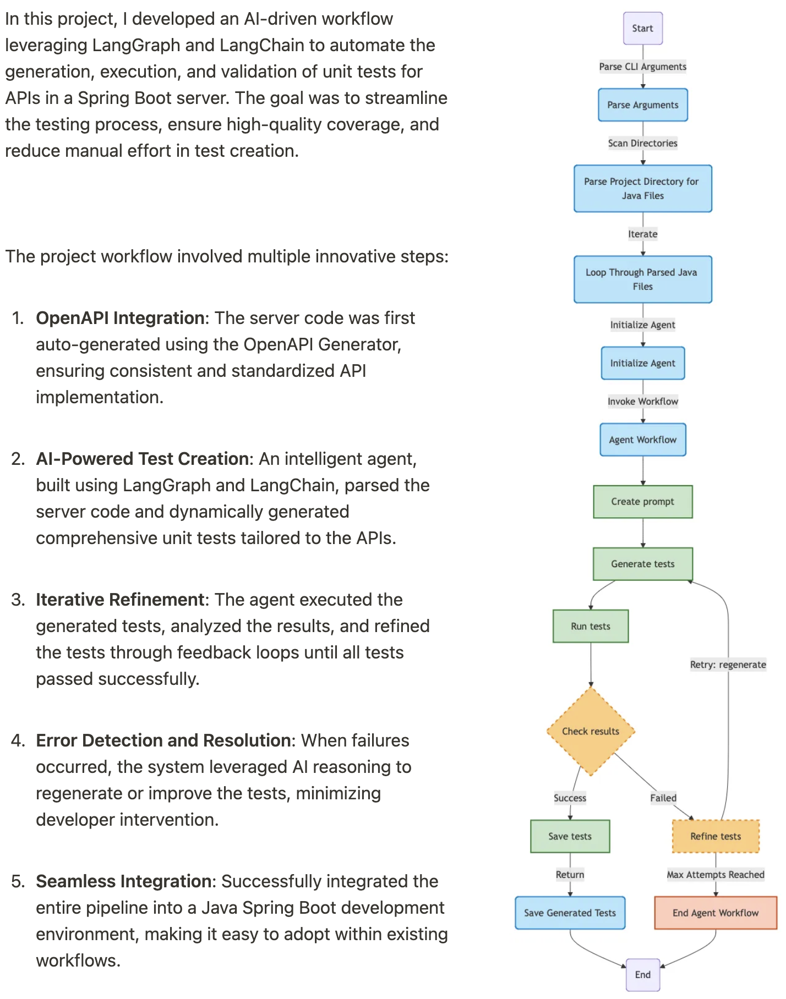

## AI-Powered Unit Test Generation for Spring Boot APIs

The project leveraged **best software engineering practices** by implementing a modular and maintainable codebase, ensuring scalability and reusability across different workflows.

By employing **OpenAI's LLM** in conjunction with **LangGraph** and **LangChain**, the system harnessed cutting-edge AI technology to streamline and automate unit test creation. To ensure a consistent development environment, the entire pipeline was containerized using **Docker**, enabling smooth deployment and eliminating environment-related issues. Additionally, a **Makefile** was designed to automate repetitive tasks, simplifying commands and reducing developer effort. This automation not only improved productivity but also made the system highly developer-friendly. The combination of modular design, AI-driven automation, and robust tooling made this pipeline an efficient, scalable, and indispensable addition to the development lifecycle.

