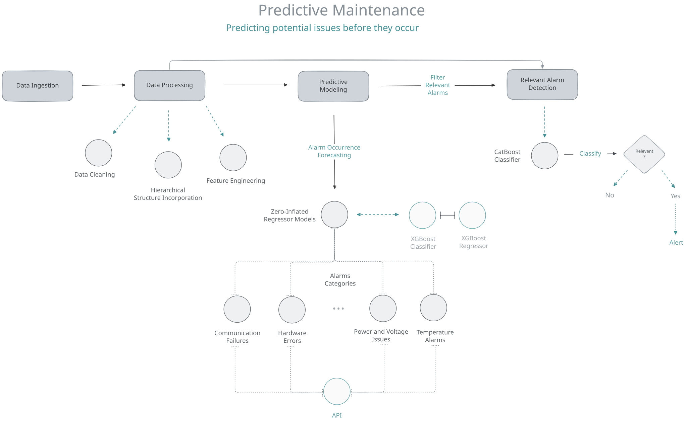
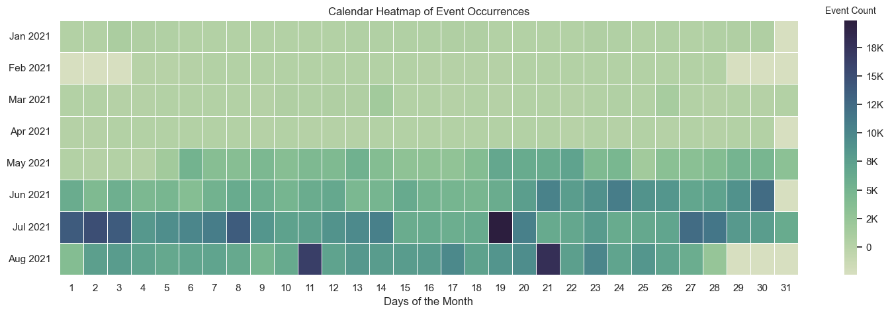
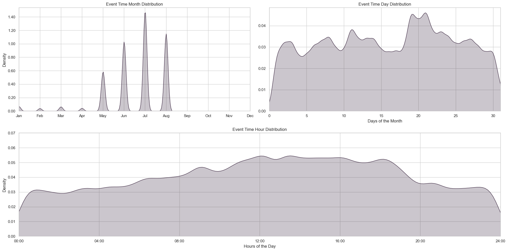
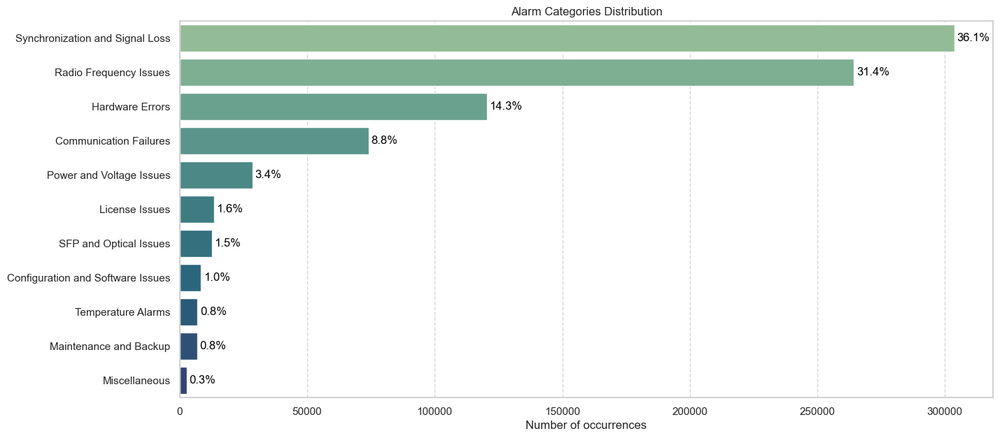
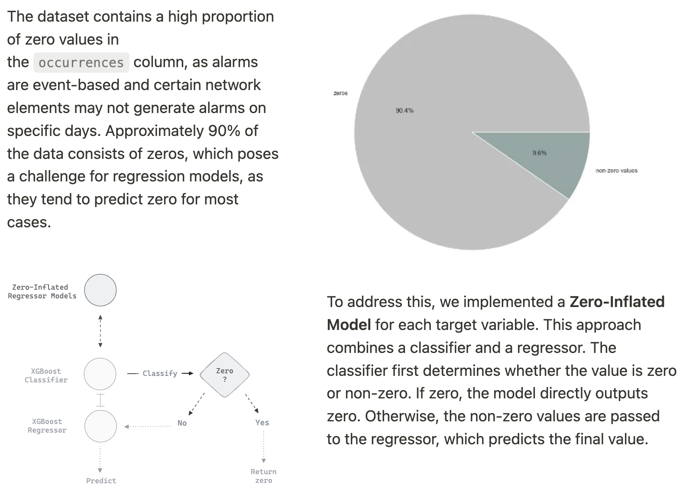
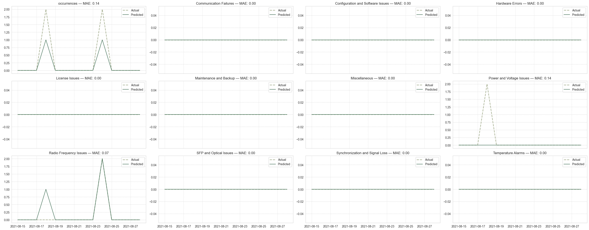
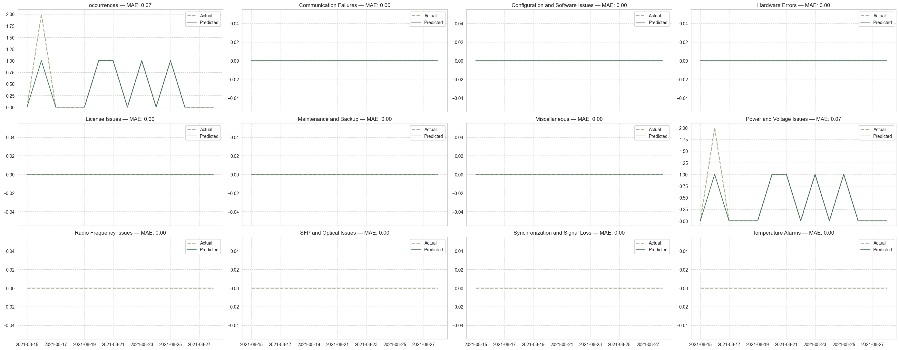
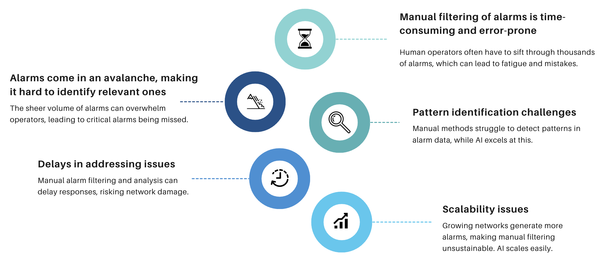
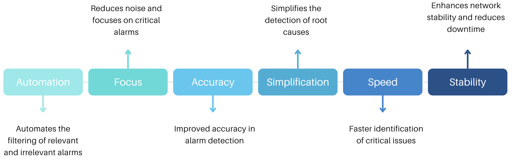

# Predictive Maintenance

Designed, Developed and Deployed a predictive system that forecasts the number of alarm occurrences for each alarm category across Network Elements (Routers, Cell Towers, etc...) over the next 14 days. The system aims to enable **predictive maintenance** by identifying potential **issues before they occur**, integrating with existing operational systems to automate ticket creation, and providing actionable insights to improve network reliability and reduce downtime.

**Outcome and Business Value**:
- **Proactive Maintenance**:
    - Early identification of potential issues allows for timely interventions.
    - Reduction in network downtime and improved service reliability.
- **Resource Optimization**:
    - Efficient allocation of maintenance resources based on predicted needs.
- **Improved Decision Making**:
    - Data-driven insights enable better strategic planning.
- **Integration with Business Processes**:
    - Seamless integration with existing systems enhances operational efficiency.

## Introduction: Enhancing Fault Management Systems

This project is a unified effort to improve fault management systems by addressing two critical aspects of network maintenance:

**Relevant Alarm Detection:** Classifying alarms as relevant or irrelevant to reduce unnecessary noise and focus resources on impactful issues.     
**Predictive Alarm Occurrences:** Forecasting the number of alarms for each category over a 14-day horizon to enable proactive interventions.
By combining these objectives, the system not only predicts future alarms but also determines which alarms require immediate attention. This holistic approach enhances network reliability by minimizing downtime, optimizing resource allocation, and improving decision-making.

## Data Ingestion
We are utilizing historical data to analyze and develop a machine learning model capable of forecasting future alarm occurrences.
The full dataset contains approximately 3.8 million alarm events from 2019 to 2021. For the purpose of this project, we filtered the data to include only alarms that occurred in 2021, resulting in a subset of about 850,000 alarm events with 14 features.
The most important features that we were interesting in are:
- `date`: date time of when the alarm has occurred
- `site_id` : site location of the Network Element (NE)
- `ne_name`: network element name
- `zone_circle` : zone location of the NE
- `ne_type`: type of the device
- `vendor`: vendor type of the NE *(e.g. Huawei, Ericsson, ...)*
- `technology`: technology type of the NE *(e.g. 3G, 4G, ...)*     
**Target variables :**  
- `alarm_category`: category of the alarm that has occurred *(e.g. Signal Loss, Temperature Alarms, ...)*
- `occurrences`: alarm occurrences

## Data Exploration

Interestingly, we found significant variations in alarm occurrences across different days. Some days showed no recorded alarms at all, while others experienced substantial spikes in alarm events. 

_The darker the shade, the more alarms occurred on that day._

A notable example is July 19, 2021, which saw around 20,000 alarms - a clear contrast to the previous day, July 18, 2021, which recorded only 6,000 alarms. This dramatic fluctuation raises questions about the factors contributing to such spikes and could be a valuable area for further investigation.

*A deeper view : Event Time Distributions*  

The temporal analysis also revealed that no alarms were recorded after **August 2021**, which likely indicates the range of the collected data. Additionally, we observed a tendency for most alarms to occur **between 11:00 and 18:00**, suggesting a possible correlation with peak operational hours or other time-dependent factors.

## Data Processing

We had about 191 unique alarms, which is hard to predict, so we decided to regroup these alarms into categories.  

We process the data in a way that we see the distribution of occurrences for each category, and these new occurrences given the categories become our targets variables.

### Explanation of Categories

- **Communication Failures:** Alarms indicating issues with network communication links, such as downed Ethernet connections, failed remote communications, or link failures.
- **Synchronization and Signal Loss:** Alarms related to loss of synchronization signals, thresholds being crossed for errors, and other signal integrity issues.
- **Hardware Errors:** Alarms indicating hardware malfunctions or units that are inaccessible or in need of repair.
- **Power and Voltage Issues:** Alarms concerning power supply problems, such as power failures or voltage irregularities.
- **Temperature Alarms:** Alarms triggered by excessive temperatures, which can indicate cooling failures or environmental issues.
- **License Issues:** Alarms related to missing licenses, activation key violations, or expiring demo modes.
- **Configuration and Software Issues:** Alarms due to incorrect configurations, software errors, or file integrity problems.
- **Maintenance and Backup:** Alarms indicating maintenance activities, backup failures, or units in repair.
- **Radio Frequency Issues:** Alarms involving RF input/output levels, frequency problems, or other radio-related issues.
- **SFP and Optical Issues:** Alarms related to SFP modules and optical signal problems, such as low transmit or receive power.
- **Miscellaneous:** Alarms that do not fit neatly into the other categories or require additional context to classify accurately.

### Feature Engineering

For each target variable we are creating :
- lagged features
- rolling window statistics
- datetime features extractions and target encoding them
- cyclical transformations of these datetime features
- Fourrier transformations

As we got also a big variance in the target columns, we might have a big number for ocurrences and and we also might have a small number for occurrences we scale the target variables using the log1p transformation, categorical columns are ecoded as well.

### Modeling
#### Predictive Modeling

##### Predictions samples

The model was evaluated Network Elements (NE) by forecasting alarm occurrences for the next 14 days and comparing predictions to actual values. 

While it accurately identified the days alarms would occur, the exact counts sometimes varied. For categories like Communication Failures, predictions were perfect, but for Power and Voltage Issues, the model underestimated by two alarms. Similarly, for Radio Frequency Issues, it correctly forecasted alarm days but overestimated by one alarm. Performance was measured using Mean Absolute Error (MAE), where lower values indicate better accuracy.

Here is another example, for a different Network Element (NE) :

For this NE, the model again demonstrates its capability to predict alarm occurrences for the next 14 days. In this case, the Power and Voltage Issues category shows alternating predictions that align with the general pattern, but the model underestimates two occurrences on specific days. For Radio Frequency Issues, the model accurately predicts the occurrence days but slightly overestimates the magnitude of one alarm. Meanwhile, categories such as License Issues, Communication Failures, and others maintain perfect predictions with zero deviation.

The overall Mean Absolute Error (MAE) remains low, highlighting the model's reliability in forecasting alarm trends across various categories

---

#### Relevant Alarm Detection
In this step, we classify the predicted alarms as either **relevant** or **irrelevant** based on their nature. Alarms are considered irrelevant if they meet any of the following criteria:

- They are temporary and resolve on their own.
- They are triggered during scheduled maintenance.
- They originate from known faulty equipment.

  

We trained a `CatBoostClassifier` on historical data to predict whether an alarm is relevant. Using the predictions from the earlier step, we generate alerts for relevant alarms expected to occur in the next 14 days.

## Benefits and Business Impact

  

 

> ### Data Confidentiality and Security
> Given the sensitive nature of data, this project takes data security very seriously. The repository does not include any confidential information, with all sensitive data omitted or anonymized. The focus is on showcasing the methodologies and workflows rather than the specific data itself, ensuring compliance with data protection regulations.

