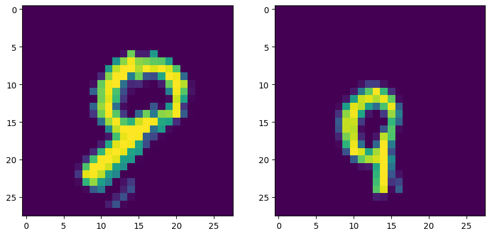

 

# Apprentissage Contrastif : SimCLR

L'apprentissage contrastif est une **forme d’apprentissage non supervisé** où l'objectif est d'apprendre des **représentations des données utiles pour des tâches ultérieures**.  
Il fonctionne en **contrastant différentes vues d’un même point de données dans un espace latent**, favorisant ainsi **des représentations similaires pour un même point de données** et **différentes représentations pour des points de données distincts**.  
Cette méthode permet au modèle **d'extraire des caractéristiques pertinentes même sans données annotées**.

**SimCLR** est une méthode d’apprentissage contrastif introduite en **2020**. Elle maximise la similarité entre **des vues augmentées d'une même image** et minimise la similarité entre **des vues augmentées d’images différentes**.  
SimCLR utilise **une architecture neuronale simple et efficace** et a obtenu des résultats **à la pointe de l’état de l’art** sur plusieurs ensembles de données de référence.  
Il a été largement adopté dans la communauté du deep learning et est considéré comme une **approche prometteuse** pour apprendre des représentations utiles à partir de **données non étiquetées**.

L'objectif principal de ce projet est de proposer une **approche utilisant SimCLR sur le dataset MNIST** afin d’obtenir **un modèle performant avec seulement 100 données étiquetées**.  
Pour y parvenir :
1. **Pré-entraînement du modèle** sur **des données augmentées non étiquetées**.
2. **Entraînement final** du modèle sur les **100 données étiquetées**.

---

## **Modèle**

Notre modèle repose sur **l’association d’un encodeur et d’un projection head**.  
- Cette **architecture complète est entraînée sur des vues augmentées** des données non étiquetées avec **une fonction de perte contrastive**, permettant d’apprendre une **représentation riche et utile** des images en entrée.  
- Ensuite, **le projection head est supprimé**, et **seul l’encodeur pré-entraîné est conservé** pour réaliser la tâche de classification en aval.

---

## **Benchmark**

En appliquant un **pré-entraînement avec SimCLR**, nous avons observé **une amélioration d’environ 7% de l’exactitude** par rapport au **modèle de référence** (un réseau de neurones convolutionnel classique).

|  | Exactitude top-1 |
| --- | --- |
| Modèle de base | 0.8462 ± 0.0042 |
| SimCLR | 0.9194 ± 0.0030 |

---

## **Références**

 - [A simple framework for contrastive learning of visual representations, T. Chen, S. Kornblith, M. Norouzi, G. Hinton](https://arxiv.org/abs/2002.05709)
 - [Github giakou4](https://github.com/giakou4)

---

## **Contributeurs**

 - [Tristan Margate](https://github.com/Tmargate)
 - [Ahmed Osman](https://github.com/AhmedOsman00py)
 - [Bourahima Coulibaly](https://github.com/CouLiBaLy-B)
